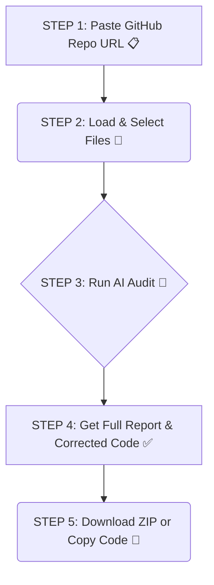

<div align="center">

# 🤖 GitHub Repo Auditor AI 🔍

**Audit, analyze, and improve your GitHub repositories in seconds with the power of AI.**

[GitHub Repo Auditor AI](https://github-repo-auditor-ai-95485695052.us-west1.run.app)

**Auditez, analysez et améliorez vos dépôts GitHub en quelques secondes grâce à la puissance de l'IA.**

</div>

<p align="center">
  
  
  
  
  
</p>

---

This tool leverages the Google Gemini API to perform an expert-level audit of your source code. It identifies potential issues, suggests best practices, and even provides corrected code that you can directly implement.

## ✨ How It Works / Comment ça marche

<div align="center">


*A visual representation of the app's workflow.*
</div>

---

## 🇬🇧 English

### ➤ About The Project

This web application provides a simple yet powerful interface to audit public GitHub repositories.

1.  **Load any public repository**: Just by pasting its URL.
2.  **Select relevant files**: You have full control over which files get sent for analysis.
3.  **Get an expert analysis**: The AI provides a summary, per-file analysis, and ready-to-use corrected code.
4.  **Improve your code**: Enhance security, performance, readability, and maintainability.

### ➤ Key Features

-   **Dynamic File Tree Loading**: Automatically fetches the file structure of any public GitHub repo.
-   **Selective Auditing**: Choose exactly which files you want the AI to analyze.
-   **AI-Powered Analysis**: Uses Google Gemini for in-depth code review.
-   **Comprehensive Reports**: Delivers a high-level summary and detailed per-file breakdowns.
-   **Ready-to-Use Code Fixes**: Provides complete, corrected code for each analyzed file.
-   **Download All Fixes**: A handy "Download All" button zips up the corrected files for you.
-   **Git Push Instructions**: Clear, copy-paste commands to help you apply the changes to your repository.

### ➤ How to Use

1.  **Navigate** to the application website (replace with your deployed URL).
2.  **Paste** the URL of a public GitHub repository (e.g., `https://github.com/Krigsexe/github-repo-auditor-ai`).
3.  **Click** "Load Files".
4.  **Select** the files you wish to audit from the list.
5.  **Click** "Audit X File(s)" and wait for the AI to work its magic.
6.  **Review** the audit summary and the detailed analysis for each file.
7.  **Download** a `.zip` file with all corrected files or copy individual code snippets.

### ➤ Local Development Setup

To run this project locally, follow these steps:

1.  **Clone the repository**
    ```sh
    git clone https://github.com/Krigsexe/github-repo-auditor-ai.git
    cd github-repo-auditor-ai
    ```
2.  **Install dependencies** (assuming you have Node.js and npm installed)
    ```sh
    npm install
    ```
3.  **Set up environment variables**
    - Create a file named `.env` in the root of the project.
    - Add your Google Gemini API key to it:
      ```
      API_KEY=your_google_gemini_api_key_here
      ```
4.  **Start the development server**
    ```sh
    npm run start 
    ```
    The application should now be running on your local machine.

---

## 🇫🇷 Français

### ➤ À Propos du Projet

Cette application web fournit une interface simple et puissante pour auditer les dépôts GitHub publics.

1.  **Chargez n'importe quel dépôt public**: Simplement en collant son URL.
2.  **Sélectionnez les fichiers pertinents**: Vous contrôlez entièrement les fichiers envoyés à l'analyse.
3.  **Obtenez une analyse d'expert**: L'IA fournit un résumé, une analyse par fichier et du code corrigé prêt à l'emploi.
4.  **Améliorez votre code**: Renforcez la sécurité, la performance, la lisibilité et la maintenabilité.

### ➤ Fonctionnalités Clés

-   **Chargement Dynamique de l'Arborescence**: Récupère automatiquement la structure des fichiers de n'importe quel dépôt GitHub public.
-   **Audit Sélectif**: Choisissez précisément les fichiers que vous souhaitez que l'IA analyse.
-   **Analyse par l'IA**: Utilise Google Gemini pour une revue de code approfondie.
-   **Rapports Complets**: Fournit un résumé de haut niveau et des analyses détaillées pour chaque fichier.
-   **Corrections de Code Prêtes à l'Emploi**: Propose le code entièrement corrigé pour chaque fichier analysé.
-   **Télécharger Toutes les Corrections**: Un bouton pratique "Télécharger Tout" compresse les fichiers corrigés dans un ZIP.
-   **Instructions Git Push**: Des commandes claires à copier-coller pour vous aider à appliquer les changements sur votre dépôt.

### ➤ Comment l'Utiliser

1.  **Naviguez** vers le site de l'application (remplacez par votre URL de déploiement).
2.  **Collez** l'URL d'un dépôt GitHub public (ex: `https://github.com/Krigsexe/github-repo-auditor-ai`).
3.  **Cliquez** sur "Charger les Fichiers".
4.  **Sélectionnez** les fichiers que vous souhaitez auditer dans la liste.
5.  **Cliquez** sur "Auditer X Fichier(s)" et attendez que l'IA opère sa magie.
6.  **Examinez** le résumé de l'audit et l'analyse détaillée de chaque fichier.
7.  **Téléchargez** un fichier `.zip` avec tous les fichiers corrigés ou copiez les extraits de code individuellement.

### ➤ Installation pour Développement Local

Pour exécuter ce projet en local, suivez ces étapes :

1.  **Clonez le dépôt**
    ```sh
    git clone https://github.com/Krigsexe/github-repo-auditor-ai.git
    cd github-repo-auditor-ai
    ```
2.  **Installez les dépendances** (en supposant que Node.js et npm sont installés)
    ```sh
    npm install
    ```
3.  **Configurez les variables d'environnement**
    - Créez un fichier nommé `.env` à la racine du projet.
    - Ajoutez-y votre clé API Google Gemini :
      ```
      API_KEY=votre_cle_api_google_gemini_ici
      ```
4.  **Démarrez le serveur de développement**
    ```sh
    npm run start
    ```
    L'application devrait maintenant être accessible sur votre machine locale.

---

<div align="center">
Made with ❤️ by <a href="https://github.com/Krigsexe" target="_blank">Krigs</a>
</div>
